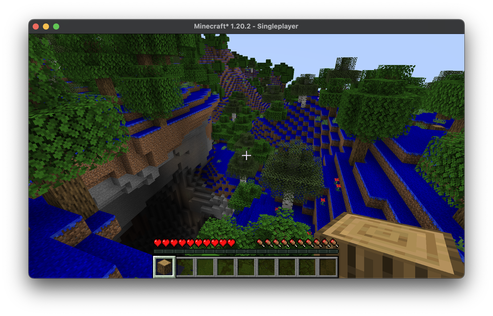

# BlueGrass Mod for Minecraft



## Description

BlueGrass is a Minecraft mod that changes the color of grass blocks to blue. This mod is built using the Fabric modding platform and is intended for Minecraft version 1.20.2.

## Table of Contents

- [Installation](#installation)
- [Usage](#usage)
- [How It Works](#how-it-works)
- [Dependencies](#dependencies)
- [License](#license)
- [Contact](#contact)

## Installation (just to run, no source)

1. Make sure you have Fabric Loader and Fabric API installed.
2. Download the latest version of BlueGrass from the [releases page](https://github.com/haslo/blue_grass_mod/releases).
3. Place the downloaded `.jar` file into your `mods` folder inside your Minecraft directory.

## Usage

Simply install the mod and launch the game. Grass blocks will appear blue in the game world.

## How It Works

### High-Level Overview

1. **Initialization**: When the game starts, the `BlueGrassClient` class is triggered. This class registers a custom model for the grass block.

2. **Model Loading**: The `UnbakedBlueGrassModel` class takes care of creating a custom model for the grass block. It specifies how the block should look before it's rendered.

3. **Model Baking**: The `BakedBlueGrassModel` class finalizes the model, making it ready for rendering in the game.

### Key Concepts for Beginners

- **Fabric API**: A set of libraries that make it easier to modify Minecraft.

- **Model**: In Minecraft, a model defines the shape and appearance of a block or item.

- **Unbaked Model**: A model that is not yet ready for rendering. It's like a blueprint.

- **Baked Model**: A model that is ready for rendering in the game.

- **Sprite**: A 2D image that represents a texture.

- **Mesh**: A collection of vertices, edges, and faces that defines the shape of a 3D object.

## Dependencies

- Fabric Loader >= 0.14.22
- Minecraft ~1.20.2
- Java >= 17
- Fabric API

## Complete Dev Installation Guide for Beginners

If you're starting from scratch, here's how to get everything set up to use this mod and even modify it yourself.

### Step 1: Install the JDK (Java Development Kit)

1. Download and install the JDK. For this mod, you'll need JDK 17 or higher. You can download it from [Oracle's website](https://www.oracle.com/java/technologies/javase-jdk17-downloads.html) or use [AdoptOpenJDK](https://adoptopenjdk.net/).
2. Set up environment variables. If you're on Windows, you'll need to add Java to your PATH. Here's a [tutorial for Windows](https://www.java.com/en/download/help/path.html).

### Step 2: Install an IDE (Integrated Development Environment)

You can use any text editor or IDE you're comfortable with. Here are two popular choices:

- [Visual Studio Code](https://code.visualstudio.com/): Lightweight and highly customizable.
- [Sublime Text](https://www.sublimetext.com/): Known for its speed and ease of use.
- [IntelliJ IDEA](https://www.jetbrains.com/idea/): Robust and feature-rich, my choice.

### Step 3: Install Fabric

1. Download the [Fabric Installer](https://fabricmc.net/use/).
2. Run the installer and select the "Client" tab.
3. Choose the Minecraft version you want (in this case, 1.20.2).
4. Click "Install."

### Step 4: Download and Install Fabric API

1. Download the Fabric API from [CurseForge](https://www.curseforge.com/minecraft/mc-mods/fabric-api).
2. Place the downloaded `.jar` file into your `mods` folder inside your Minecraft directory.

### Step 5: Clone and Build the Mod

1. Clone this repository to your local machine, or download the zip file.
2. Open a terminal and navigate to the directory where you cloned the repository.
3. Run the following commands to build and run the mod:

```bash
# Build the mod
gradlew.bat build

# Run the mod in a development environment
gradlew.bat runClient
```

## Version History

* **1.0.0** Initial Release
* **1.1.0** Color provider for biome colors, also blueified tufts of grass
* **1.1.2** Refactoring and cleanup

## License

This project is licensed under the MIT License. See the [LICENSE](LICENSE) file for details.

## Contact

- Homepage: [haslo.ch](https://haslo.ch/)
- Source Code: [GitHub](https://github.com/haslo/blue_grass_mod)

