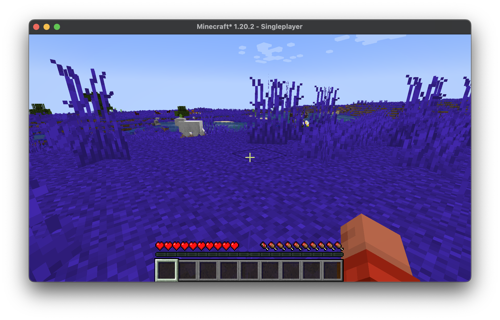

# BlueGrass Mod for Minecraft

## Description

BlueGrass is a Minecraft mod that changes the color of grass blocks to blue. This mod is built using the Fabric modding platform and is intended for Minecraft version 1.20.2.

## Table of Contents

- [Installation](#installation)
- [Usage](#usage)
- [How It Works](#how-it-works)
- [Dependencies](#dependencies)
- [License](#license)
- [Contact](#contact)

## Installation

1. Make sure you have Fabric Loader and Fabric API installed.
2. Download the latest version of BlueGrass from the [releases page](https://github.com/haslo/blue_grass_mod/releases).
3. Place the downloaded `.jar` file into your `mods` folder inside your Minecraft directory.

## Usage

Simply install the mod and launch the game. Grass blocks will appear blue in the game world.

## How It Works

### High-Level Overview

1. **Initialization**: When the game starts, the `BlueGrassClient` class is triggered. This class registers a custom model for the grass block.

2. **Model Loading**: The `UnbakedBlueGrassModel` class takes care of creating a custom model for the grass block. It specifies how the block should look before it's rendered.

3. **Model Baking**: The `BakedBlueGrassModel` class finalizes the model, making it ready for rendering in the game.

### Key Concepts for Beginners

- **Fabric API**: A set of libraries that make it easier to modify Minecraft.

- **Model**: In Minecraft, a model defines the shape and appearance of a block or item.

- **Unbaked Model**: A model that is not yet ready for rendering. It's like a blueprint.

- **Baked Model**: A model that is ready for rendering in the game.

- **Sprite**: A 2D image that represents a texture.

- **Mesh**: A collection of vertices, edges, and faces that defines the shape of a 3D object.

## Dependencies

- Fabric Loader >= 0.14.22
- Minecraft ~1.20.2
- Java >= 17
- Fabric API

## License

This project is licensed under the MIT License. See the [LICENSE](LICENSE) file for details.

## Contact

- Homepage: [haslo.ch](https://haslo.ch/)
- Source Code: [GitHub](https://github.com/haslo/blue_grass_mod)

